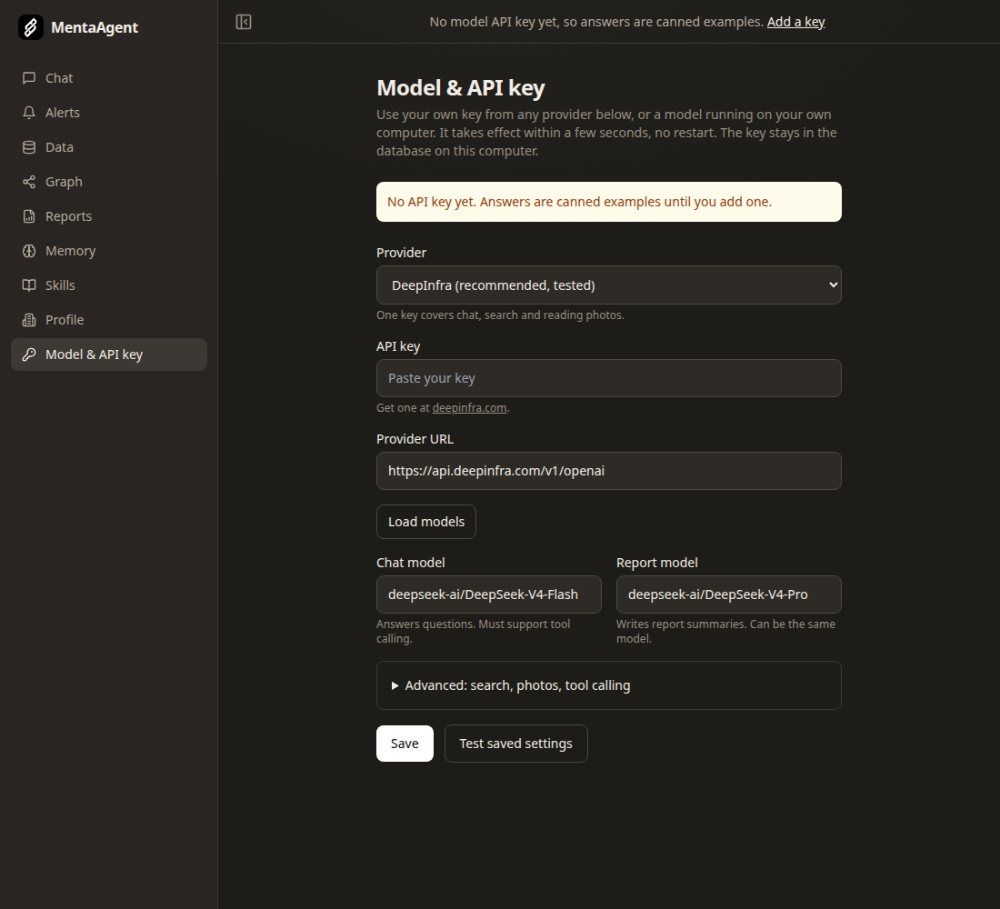
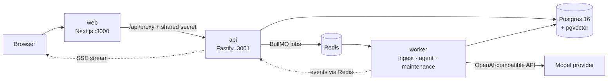

# MentaAgent

**An AI business analyst that actually knows your business.** It runs on your
own computer, uses open-weight models, and is free (Apache 2.0).

Give it a company's spreadsheets, contracts, PDFs and emails. It tells you what
the business is lacking, where the risks are, and what to improve, with every
answer naming the file it came from. It remembers what it learns across
conversations.

<!-- TODO: 20-second GIF (upload a file, ask, see the citation) -->

## What you get

**Ask anything about your business.** Upload spreadsheets, contracts, PDFs and
emails. The analyst investigates the real numbers and answers with citations
back to the source.

**Gap-analysis reports.** A health check across finance, customers, contracts,
operations and more: each dimension scored, with the top gaps and what to do
next.

**It remembers and improves.** Per-business memory and learned playbooks mean
it gets sharper at advising you over time, and it flags new risks on a
schedule.

All of it runs on your machine. There is no account, no sign-up, no
subscription. Your files stay on your computer; only what the agent reads is
sent to the model provider you choose.

## Quickstart

You need Docker with Compose v2.

```bash
git clone https://github.com/DanielKim03/mentaagent.git
cd mentaagent
docker compose up
```

Open http://localhost:3000. That's it: no account to create.

1. **Add a model key.** Open **Model & API key** in the sidebar, pick your
   provider, paste your own key and press Save. It takes effect within
   seconds, no restart. "Load models" lists the models your provider offers,
   and "Test saved settings" checks the key before you rely on it.
2. **Tell it about the business** on the **Profile** page.
3. **Upload files** on the **Data** page. To try it without your own data, use
   [`samples/`](samples/): a fictional catering company's revenue, clients,
   contracts, vendors and inventory.
4. **Ask** in **Chat**.

Without a key the app still runs, on a **stub model** that gives canned
answers. That's useful for seeing how the pieces fit before spending anything,
but not for real questions.

The first build takes a few minutes; later starts take seconds. Your database,
uploaded files and settings are kept in Docker volumes between restarts.



### Good to know

- **Only your computer can open it.** There is no login, so Docker publishes
  the app on `127.0.0.1` only. To reach it from another device, put it behind
  something that does authentication (a VPN such as Tailscale, or a reverse
  proxy with a password). Do not simply open the port.
- **Any provider, your own key.** The page has presets for DeepInfra, OpenAI,
  Anthropic (Claude), Google Gemini, OpenRouter, Groq, Mistral, DeepSeek,
  Together and Ollama, plus any other OpenAI-compatible server. Only DeepInfra
  has been tested end to end with a real key; the others follow each
  provider's OpenAI-compatibility documentation, and the test button tells
  you quickly if something is off. The chat model must support tool calling.
- **Free and offline with Ollama.** Pick "Ollama", no key needed; the app
  reaches it on your computer at `host.docker.internal:11434`.
- **Search and photos depend on the provider.** Semantic search needs an
  embeddings model that returns 1024-dimension vectors (DeepInfra, OpenAI,
  Gemini, Mistral, Together and Ollama have one). Anthropic, Groq, DeepSeek and
  OpenRouter don't, so search falls back to keywords; you can add a separate
  embeddings provider under Advanced.
- **Missing keys turn features off rather than breaking the app.** With no
  embeddings key, search falls back to Postgres full-text. With no vision
  model, image uploads are refused.
- **Reports run on their own**, weekly and monthly once you have uploaded
  files. With a real model each one costs money on your provider's account.
  `LLM_DAILY_USD_CAP` (below) sets a daily ceiling.

### Optional settings

Everything works without these. To use one, create a file named `.env` next to
`docker-compose.yml`, put the line in it, and restart with
`docker compose up -d`.

| Setting | What it does |
|---|---|
| `LLM_DAILY_USD_CAP=5` | Stops model calls for the day once spending reaches $5. Default: no cap. |
| `WEB_ORIGIN=https://your.domain` | The address the app is served on, if not `http://localhost:3000`. It is built into the app, so rebuild after changing it: `docker compose up -d --build`. |
| `LLM_API_KEY`, `LLM_BASE_URL`, `AGENT_MODEL`, `HEAVY_MODEL`, `LLM_TOOL_MODE`, `EMBEDDINGS_API_KEY`, `EMBEDDINGS_BASE_URL`, `EMBEDDINGS_MODEL`, `VISION_MODEL` | The same model settings as the Settings page, for people who prefer a file. Values saved on the page win. |

## What it does, in detail

- **Reads your files.** CSV, Excel, PDF, Word, `.eml`, plain text, and photos
  (through a vision model). Each file is parsed, chunked and embedded in the
  background.
- **Answers with citations.** The agent investigates with tools over your data
  (search, read, aggregate, calculate) and names the source document for each
  claim.
- **Knowledge graph.** Documents are linked to the people, customers, vendors,
  products and contracts they mention. The agent follows those links to reason
  across files, and you can browse them.
- **Remembers.** Memory in four categories: business facts, owner preferences,
  advisor notes, open loops, each with a hard size limit so it gets
  consolidated instead of growing forever. You can read and edit all of it.
- **Learns playbooks.** After a conversation goes idle, a reflection run can
  propose a new skill (a markdown playbook). Nothing is added until you approve
  it.
- **Reports.** Seven dimensions, each investigated with a fresh context, then
  summarised by a larger model.
- **Alerts.** A weekly monitor run checks what you asked it to watch and what
  changed, and raises alerts only when something is worth raising.

## Architecture



Three processes and two databases, all started by `docker compose up`. The
**web** app (Next.js) renders the pages and forwards browser requests to the
**api** (Fastify), which only it can call. The api writes to Postgres and puts
jobs on Redis queues. The **worker** does the slow work: parsing and embedding
uploads, running the agent, and a maintenance tick every 15 minutes (reflection
on idle chats, the weekly monitor, memory consolidation, scheduled reports).
Agent output streams back to the browser as it is generated: worker → Redis
pub/sub → api → server-sent events. Every model call goes through one
OpenAI-compatible client, so switching providers is a settings change.
Developer notes, conventions and local setup without Docker are in
[`CLAUDE.md`](CLAUDE.md).

## Parts you can reuse on their own

These solve problems that come up in most LLM agent projects:

- **Spend accounting that can't be raced**
  ([`services/llm/client.ts`](apps/api/src/services/llm/client.ts)). Every
  model call reserves its estimated cost in Postgres under an advisory lock
  before it runs, then reconciles to the real token count. Concurrent calls
  can't all slip under a cap at once, and a failed call is not billed.
- **An agent loop with guard rails**
  ([`services/agent/loop.ts`](apps/api/src/services/agent/loop.ts)). Per-run
  limits on steps, cost and wall-clock time; a cancel flag in Redis; tool
  errors handed back to the model so it can correct itself, a nudge after 2
  failures in a row and a stop after 4.
- **Tool calling for models without it**
  ([`services/agent/provider.ts`](apps/api/src/services/agent/provider.ts)).
  Native OpenAI-style tools, or Hermes-style XML (schemas in the prompt,
  `<tool_call>` blocks parsed out of the text) for hosts that don't support
  tools, plus a scriptable stub provider for tests.
- **Bounded memory**
  ([`services/memory/store.ts`](apps/api/src/services/memory/store.ts)). Four
  categories with hard character budgets. A write over budget fails with
  "consolidate first", which makes the agent merge old entries rather than
  append forever, and duplicates are skipped.
- **Prompt-injection hygiene.** Document text is always wrapped in
  `<document>` markers and the model is told it is data, never instructions.
  Tools are whitelisted per kind of run, and the workspace id comes from the
  job, never from model output. This reduces the risk; it does not remove it.

## Models

Defaults, all on [DeepInfra](https://deepinfra.com) with one key:

| Job | Model | List price per million tokens (Jun 2026) |
|---|---|---|
| Chat and agent work | `deepseek-ai/DeepSeek-V4-Flash` | $0.10 in / $0.20 out |
| Report summaries | `deepseek-ai/DeepSeek-V4-Pro` | $1.30 in / $2.60 out |
| Embeddings | `BAAI/bge-m3` (1024 dimensions) | $0.01 |
| Reading images | `Qwen/Qwen3-VL-30B-A3B-Instruct` | $0.15 in / $0.60 out |

**What it actually cost**, from the development database (DeepSeek V4 Flash).
The samples are small, so read these as orders of magnitude:

| Run | Measured runs | Average | Highest |
|---|---|---|---|
| A chat question | 2 | $0.003 | $0.004 |
| Weekly monitor | 28 | $0.012 | $0.047 |
| Memory consolidation | 28 | $0.0005 | $0.002 |

Embedding about 31,000 tokens of documents cost $0.0004 in total. No full
report finished in the measured data, so there is no report figure yet. Each
kind of run also has a hard cost cap in
[`services/agent/types.ts`](apps/api/src/services/agent/types.ts) (for
example $0.25 per chat answer, $2 per report).

Also used during development: Nous Hermes 4 70B/405B on Nebius, and
DeepSeek's own API. Prices for other models are in the table at the top of
[`services/llm/client.ts`](apps/api/src/services/llm/client.ts); a model
missing from it is metered at a deliberately high fallback rate and logs a
warning, so add yours there.

## Why it exists

Technology should be something anyone can choose to use, not only what a few
companies ship. Most people only choose it when it is as easy as the default,
so this is packaged to run with one command and no configuration files.
MentaAgent is released as finished work in that spirit. Nothing is being sold
here.

## Status

Built in eight days in June 2026 as a subscription product, stopped before
launch, and released here as finished work: accounts and billing removed, one
person per install. There is no hosted version and no company behind it.

What works: everything above, tested end to end on a fresh clone with
`docker compose up`. What is not built: connectors (Google Drive and others),
a button to generate a report on demand, PDF export of reports beyond print
styles.

The maintainer starts 18 months of military service in October 2026 and will
be slow to answer issues and pull requests until April 2028. The code is
yours to fork.

## Contributing

Issues and pull requests are welcome; expect slow replies until April 2028
(see above). To work on the code without Docker for the apps:

```bash
docker compose up -d postgres redis
pnpm install
pnpm --filter api migrate
pnpm --filter api dev          # API on :3001
pnpm --filter api dev:worker   # worker, in a second terminal
pnpm --filter web dev          # web on :3000, in a third
pnpm --filter api test         # tests use a stub model and never call a paid one
```

Good first contributions: more file types (`.doc`, `.msg`), a "generate report
now" button, translations of the UI, and pricing entries for more models.

## License

[Apache 2.0](LICENSE).
